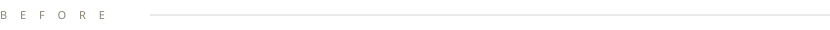

  

 
 
  
   

CS at Fordham in New York, writing code for clients since 16 — started with full-stack work for an Italian luxury furniture brand, now building two of my own products.

  

- Mielando (Italy) — full-stack development, brand & product design, international client communications. Four years, started at 16.
- Pinecone Academy — Senior Developer diploma, before university.

  
 Mongolian (native) · English (fluent)· Russian (fluent)
 
 Interests: fintech & markets, consumer products, brand building

  
eesui50@gmail.com

